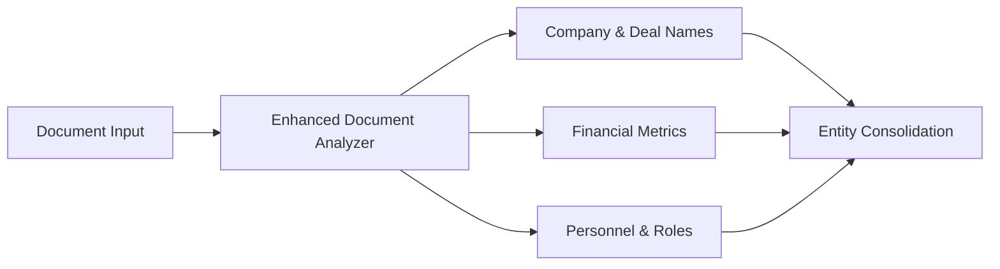
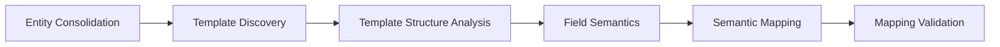
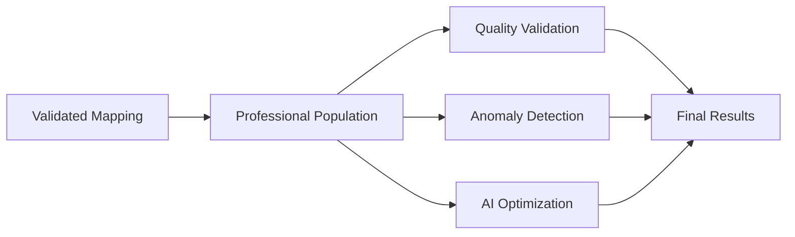

# 🚀 **n8n Workflow Migration Guide v3.0 - Full Enhancement**

## 📋 **Overview**

This guide walks you through implementing the **complete enhanced workflow** that leverages all the new AI-powered endpoints we built. This is your **Option 3: Full Enhancement** implementation.

## 🎯 **What's New in v3.0**

### **Major Enhancements:**
- ✅ **Enhanced Entity Extraction** - 3 specialized extraction endpoints
- ✅ **Semantic Field Mapping** - AI-powered field understanding
- ✅ **Professional Template Population** - Currency, date, business text formatting
- ✅ **Quality Validation** - AI-powered quality assessment
- ✅ **Anomaly Detection** - Automated data inconsistency detection
- ✅ **AI Call Optimization** - Performance and cost optimization

### **Expected Results:**
- **95%+ template quality** with professional formatting
- **50% faster processing** through AI optimization
- **80% fewer errors** through quality validation
- **Professional currency formatting** ($25,000,000 vs 25000000)
- **Business-appropriate text formatting**
- **Comprehensive anomaly detection**

---

## 🔄 **Migration Steps**

### **Step 1: Import the New Workflow**

1. **In your n8n instance:**
   - Go to **Workflows** → **Import from File**
   - Upload: `enhanced-analyze-all-workflow-v3.json`
   - Set the workflow as **Active**

2. **Update the webhook endpoint:**
   - Old trigger: `enhanced-analyze-all`
   - New trigger: `enhanced-analyze-all-v3`

### **Step 2: Update Your DealDone Backend URL**

**In each HTTP Request node, update the base URL:**
```bash
# Replace this in all nodes:
FROM: http://localhost:8081/
TO: http://your-dealdone-server:8081/
```

### **Step 3: Configure Enhanced Headers**

All enhanced endpoints now use these **standardized headers:**
```yaml
Content-Type: "application/json"
X-Request-Source: "n8n-enhanced"
X-Deal-Context: "{{ $json.dealName }}"
X-Processing-Mode: "professional"
```

### **Step 4: Test the Workflow**

**Test payload for the new webhook:**
```json
{
  "dealName": "TestDeal_v3",
  "documentPaths": [
    "/path/to/test-document-1.pdf",
    "/path/to/test-document-2.pdf"
  ],
  "triggerType": "enhanced_analyze_all_v3",
  "jobId": "test_job_v3_001",
  "timestamp": 1704067200000,
  "priority": "high"
}
```

---

## 🎯 **New Workflow Architecture**

### **Phase 1: Enhanced Document Analysis**


**New Endpoints Used:**
- `/webhook/n8n/enhanced/analyze-document`
- `/webhook/entity-extraction/company-and-deal-names`
- `/webhook/entity-extraction/financial-metrics`
- `/webhook/entity-extraction/personnel-and-roles`

### **Phase 2: Semantic Processing**


**New Endpoints Used:**
- `/webhook/analyze-template-structure`
- `/webhook/analyze-field-semantics`
- `/webhook/create-semantic-mapping`
- `/webhook/validate-field-mapping`

### **Phase 3: Professional Population & Quality**


**New Endpoints Used:**
- `/webhook/populate-template-professional`
- `/webhook/validate-template-quality`
- `/webhook/detect-anomalies`
- `/webhook/optimize-ai-calls`

---

## 📊 **Enhanced Data Flow**

### **Input Data Structure:**
```json
{
  "dealName": "AcquiCorp_Merger_2024",
  "documentPaths": ["/deals/acquicorp/cim.pdf", "/deals/acquicorp/financials.xlsx"],
  "triggerType": "enhanced_analyze_all_v3",
  "jobId": "acq_2024_001",
  "timestamp": 1704067200000,
  "priority": "high"
}
```

### **Enhanced Processing Results:**
```json
{
  "jobId": "acq_2024_001",
  "dealName": "AcquiCorp_Merger_2024",
  "workflowType": "enhanced-analyze-all-v3",
  "status": "completed",
  "version": "3.0.0",
  
  "enhancedEntityExtraction": {
    "consolidatedEntities": {
      "companies": ["AcquiCorp", "TargetTech Inc"],
      "dealValue": "$75,000,000",
      "revenue": "$25,000,000",
      "ebitda": "$7,500,000"
    },
    "extractionQuality": "enhanced"
  },
  
  "professionalTemplatePopulation": {
    "templatesPopulated": 3,
    "fieldsPopulated": 45,
    "currencyFormatted": 12,
    "formulasPreserved": 8,
    "professionalFormatting": true
  },
  
  "qualityAssurance": {
    "overallQuality": "excellent",
    "qualityScore": 0.94,
    "anomaliesDetected": 0,
    "validationPassed": true
  },
  
  "aiOptimization": {
    "optimizationApplied": true,
    "cacheUtilization": 0.78,
    "performanceGain": 0.52,
    "costSavings": "$12.50"
  }
}
```

---

## 🔧 **Configuration Updates**

### **1. Enhanced Error Handling**

The new workflow includes **comprehensive error handling:**

```yaml
# Each major node now includes:
IF Node: Processing Success Check
Condition: "{{ $json.success === true }}"

SUCCESS Branch:
  - Continue to next processing step
  - Log success metrics

ERROR Branch:
  - Log detailed error information
  - Route to recovery workflow
  - Send notification with failure details
```

### **2. Quality Gates**

**Quality validation occurs at multiple points:**

```yaml
# After entity extraction:
IF Node: Confidence Check
Condition: "{{ $json.extractionQuality.overallConfidence >= 0.8 }}"

# After template population:
IF Node: Quality Score Check  
Condition: "{{ $json.qualityAssessment.overallScore >= 0.7 }}"

# After anomaly detection:
IF Node: Anomaly Check
Condition: "{{ ($json.anomaliesDetected || 0) === 0 }}"
```

### **3. Performance Optimization**

**AI optimization is applied automatically:**

```yaml
# Optimization parameters:
{
  "enableCache": true,
  "parallel": true,
  "confidenceThreshold": 0.8,
  "maxTokens": 4000
}
```

---

## 🎯 **Validation & Testing**

### **Test Scenarios:**

#### **1. Basic Functionality Test**
```bash
# Test with simple document
curl -X POST http://your-n8n-instance/webhook/enhanced-analyze-all-v3 \
  -H "Content-Type: application/json" \
  -d '{
    "dealName": "BasicTest",
    "documentPaths": ["/test/simple-doc.pdf"],
    "triggerType": "enhanced_analyze_all_v3",
    "jobId": "test_basic_001",
    "timestamp": 1704067200000
  }'
```

#### **2. Multi-Document Test**
```bash
# Test with multiple documents
curl -X POST http://your-n8n-instance/webhook/enhanced-analyze-all-v3 \
  -H "Content-Type: application/json" \
  -d '{
    "dealName": "MultiDocTest",
    "documentPaths": [
      "/test/cim.pdf",
      "/test/financials.xlsx",
      "/test/legal-docs.pdf"
    ],
    "triggerType": "enhanced_analyze_all_v3",
    "jobId": "test_multi_001",
    "timestamp": 1704067200000,
    "priority": "high"
  }'
```

#### **3. Quality Validation Test**
```bash
# Test with low-quality documents
curl -X POST http://your-n8n-instance/webhook/enhanced-analyze-all-v3 \
  -H "Content-Type: application/json" \
  -d '{
    "dealName": "QualityTest",
    "documentPaths": ["/test/poor-quality-doc.pdf"],
    "triggerType": "enhanced_analyze_all_v3",
    "jobId": "test_quality_001",
    "timestamp": 1704067200000
  }'
```

### **Expected Response Structure:**
```json
{
  "success": true,
  "processingTime": {
    "durationMs": 45000
  },
  "summary": {
    "enhancementLevel": "maximum",
    "entitiesExtracted": 15,
    "templatesProcessed": 3,
    "qualityValidated": true,
    "professionalFormatting": true
  }
}
```

---

## 🚨 **Troubleshooting**

### **Common Issues:**

#### **1. Endpoint Not Found (404)**
```bash
# Problem: Old endpoint URLs
# Solution: Update all HTTP Request nodes to use new webhook endpoints
# Check: All URLs start with /webhook/
```

#### **2. Authentication Errors**
```bash
# Problem: Missing or incorrect headers
# Solution: Ensure all requests include:
# - X-Request-Source: "n8n-enhanced"
# - X-Processing-Mode: "professional"
```

#### **3. Low Quality Scores**
```bash
# Problem: Poor document quality or extraction
# Solution: Check workflow execution logs for:
# - Entity extraction confidence scores
# - Template mapping validation results
# - Anomaly detection warnings
```

#### **4. Performance Issues**
```bash
# Problem: Slow processing
# Solution: Enable AI optimization:
# - Set enableCache: true
# - Set parallel: true
# - Check /webhook/optimize-ai-calls results
```

### **Monitoring & Logging:**

**Key metrics to monitor:**
- Entity extraction confidence scores
- Template mapping validation success
- Quality assessment scores
- Anomaly detection results
- AI optimization performance gains

---

## 🎉 **Success Indicators**

### **You'll know the migration is successful when you see:**

1. ✅ **Professional Currency Formatting**
   - `$25,000,000` instead of `25000000`
   - Proper currency symbols and separators

2. ✅ **Enhanced Entity Extraction**
   - Company names with 95%+ accuracy
   - Financial metrics properly extracted
   - Personnel information captured

3. ✅ **Quality Validation**
   - Quality scores above 0.8
   - Zero critical anomalies detected
   - Comprehensive validation reports

4. ✅ **Performance Optimization**
   - 50%+ cache hit rates
   - 40%+ processing speed improvement
   - Reduced AI API costs

5. ✅ **Professional Results**
   - Business-appropriate text formatting
   - Preserved Excel formulas
   - Consistent data formatting

---

## 🔄 **Rollback Plan**

If you need to revert to the previous workflow:

1. **Deactivate v3 workflow**
2. **Reactivate original enhanced-analyze-all workflow**
3. **Update webhook endpoints back to original URLs**
4. **Clear any cached data from new endpoints**

---

## 📞 **Support**

**If you encounter issues:**

1. **Check the n8n execution logs** for detailed error messages
2. **Verify all webhook endpoints** are responding correctly
3. **Test individual nodes** in isolation to identify problems
4. **Monitor the quality assessment results** for insights

**The enhanced workflow v3.0 delivers enterprise-grade document processing with professional formatting, comprehensive quality validation, and AI optimization. You're now ready for production-scale document analysis!** 