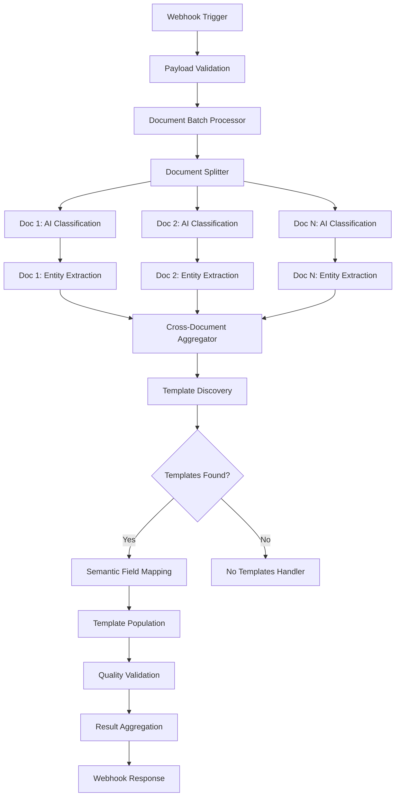

# Workflow Orchestration Logic Guide

## Overview
This document defines the orchestration logic for the Enhanced Analyze All workflow, including decision points, processing flows, error handling strategies, and quality gates.

## 1. Main Workflow Processing Flow

### Sequential vs Parallel Processing Strategy



### Processing Decision Matrix

| Document Confidence | Entity Quality | Template Match | Processing Path |
|---------------------|----------------|----------------|-----------------|
| > 0.8 | High | > 0.7 | Automated |
| 0.6 - 0.8 | Medium | > 0.5 | Assisted |
| < 0.6 | Low | > 0.3 | Manual Review |
| Any | Any | < 0.3 | No Templates Handler |

## 2. Conditional Branching Logic

### Document Classification Router
```javascript
// Confidence-based routing logic
const routingDecision = (confidence, documentType, complexity) => {
  if (confidence >= 0.8 && complexity < 0.5) {
    return {
      path: 'automated',
      priority: 'normal',
      additionalValidation: false
    };
  } else if (confidence >= 0.6 && complexity < 0.8) {
    return {
      path: 'assisted', 
      priority: 'high',
      additionalValidation: true
    };
  } else {
    return {
      path: 'manual',
      priority: 'urgent',
      additionalValidation: true,
      requiresSpecialist: true
    };
  }
};
```

### Template Availability Decision Tree
```
Template Discovery Result
├── Templates Found (> 0)
│   ├── High Relevance (> 0.7)
│   │   └── → Direct Processing
│   ├── Medium Relevance (0.4 - 0.7)
│   │   └── → Quality Validation Required
│   └── Low Relevance (< 0.4)
│       └── → Manual Template Selection
└── No Templates Found
    ├── Document Type Known
    │   └── → Suggest Template Creation
    └── Document Type Unknown
        └── → Request Manual Classification
```

### Quality Gate Validation
```javascript
// Quality gate evaluation logic
const evaluateQualityGates = (results) => {
  const gates = {
    classification: results.averageConfidence > 0.6,
    templateDiscovery: results.templateDiscovery.templatesFound > 0,
    fieldMapping: results.semanticMapping.averageConfidence > 0.5,
    population: results.templatePopulation.completionPercentage > 70,
    businessRules: results.qualityAssessment.validationChecks.businessRuleCompliance
  };
  
  const passedGates = Object.values(gates).filter(Boolean).length;
  const totalGates = Object.keys(gates).length;
  
  return {
    overallPass: passedGates >= 4, // Must pass at least 4 out of 5 gates
    passedGates,
    totalGates,
    failedGates: Object.entries(gates)
      .filter(([_, passed]) => !passed)
      .map(([gate, _]) => gate)
  };
};
```

## 3. Error Handling and Recovery Strategies

### Error Classification and Response

#### API Errors (Network/Service Failures)
```javascript
const handleAPIError = (error, context) => {
  const retryableErrors = ['TIMEOUT', 'RATE_LIMIT', 'SERVICE_UNAVAILABLE'];
  
  if (retryableErrors.includes(error.code)) {
    return {
      action: 'retry',
      delay: Math.min(1000 * Math.pow(2, context.retryCount), 30000), // Exponential backoff
      maxRetries: 3,
      fallbackEndpoint: context.fallbackEndpoints?.[0]
    };
  }
  
  return {
    action: 'fallback',
    strategy: 'simplified_processing',
    notifyAdmin: true
  };
};
```

#### Data Processing Errors
```javascript
const handleDataError = (error, payload) => {
  const errorPatterns = {
    'INVALID_DOCUMENT_FORMAT': {
      action: 'skip_document',
      continueProcessing: true,
      userMessage: 'Document format not supported'
    },
    'EXTRACTION_FAILED': {
      action: 'fallback_extraction',
      method: 'rule_based',
      reduceConfidence: 0.3
    },
    'TEMPLATE_CORRUPTION': {
      action: 'use_backup_template',
      notifyAdmin: true,
      requiresManualReview: true
    }
  };
  
  return errorPatterns[error.type] || {
    action: 'abort_processing',
    preservePartialResults: true,
    notifyUser: true
  };
};
```

### Rollback and Recovery Mechanisms

#### Checkpoint System
```javascript
const createCheckpoint = (stage, data) => {
  return {
    stage,
    timestamp: Date.now(),
    data: JSON.stringify(data),
    checksum: calculateChecksum(data),
    recoverable: true
  };
};

const rollbackToCheckpoint = (jobId, targetStage) => {
  const checkpoint = getCheckpoint(jobId, targetStage);
  if (checkpoint && checkpoint.recoverable) {
    return {
      success: true,
      restoredData: JSON.parse(checkpoint.data),
      resumeFrom: targetStage
    };
  }
  return { success: false, reason: 'Checkpoint not found or not recoverable' };
};
```

## 4. Performance Optimization Strategies

### Parallel Processing Optimization
```javascript
const optimizeParallelProcessing = (documents) => {
  const batchSize = Math.min(documents.length, 5); // Max 5 concurrent documents
  const processingGroups = [];
  
  for (let i = 0; i < documents.length; i += batchSize) {
    processingGroups.push(documents.slice(i, i + batchSize));
  }
  
  return {
    groups: processingGroups,
    estimatedTime: calculateEstimatedTime(documents),
    resourceRequirements: calculateResourceNeeds(documents)
  };
};
```

### Intelligent Caching Strategy
```javascript
const cacheStrategy = {
  documentClassification: {
    ttl: 3600000, // 1 hour
    keyPattern: 'doc_class_{documentHash}',
    invalidateOn: ['document_update', 'model_update']
  },
  templateDiscovery: {
    ttl: 7200000, // 2 hours  
    keyPattern: 'template_disc_{documentTypes}_{dealName}',
    invalidateOn: ['template_update', 'deal_update']
  },
  entityExtraction: {
    ttl: 1800000, // 30 minutes
    keyPattern: 'entity_ext_{documentHash}_{modelVersion}',
    invalidateOn: ['document_update', 'model_update']
  }
};
```

## 5. Quality Gates and Validation Points

### Stage-by-Stage Quality Validation

#### Stage 1: Document Classification
```javascript
const validateClassification = (result) => {
  const checks = {
    confidenceThreshold: result.confidence > 0.5,
    documentTypeValid: ['financial', 'legal', 'general'].includes(result.documentType),
    keywordsPresent: result.keywords && result.keywords.length > 0,
    processingTimeReasonable: result.processingTime < 30000
  };
  
  return {
    passed: Object.values(checks).every(Boolean),
    checks,
    recommendations: generateRecommendations(checks)
  };
};
```

#### Stage 2: Entity Extraction Validation
```javascript
const validateEntityExtraction = (entities, documentType) => {
  const requiredEntities = {
    financial: ['companyName', 'revenue'],
    legal: ['companyName'],
    general: ['companyName']
  };
  
  const required = requiredEntities[documentType] || ['companyName'];
  const extracted = Object.keys(entities).filter(key => entities[key]);
  
  return {
    completeness: extracted.length / required.length,
    missingRequired: required.filter(req => !entities[req]),
    qualityScore: calculateEntityQuality(entities),
    passed: extracted.length >= required.length * 0.7 // At least 70% of required entities
  };
};
```

#### Stage 3: Template Population Validation
```javascript
const validateTemplatePopulation = (populationResult) => {
  const validationChecks = {
    populationSuccess: populationResult.populationSuccess,
    completionRate: populationResult.completionPercentage > 60,
    formulaIntegrity: populationResult.formulasPreserved > 0,
    currencyFormatting: populationResult.currencyFormatted > 0,
    businessLogic: validateBusinessLogic(populationResult)
  };
  
  return {
    overallQuality: calculateOverallQuality(validationChecks),
    validationChecks,
    criticalIssues: identifyCriticalIssues(validationChecks),
    passed: validationChecks.populationSuccess && validationChecks.completionRate
  };
};
```

## 6. Workflow State Management

### State Tracking Schema
```javascript
const workflowState = {
  jobId: 'string',
  dealName: 'string',
  currentStage: 'enum[validation|classification|extraction|discovery|mapping|population|quality|aggregation]',
  progress: {
    overall: 'percentage',
    currentStage: 'percentage',
    estimatedTimeRemaining: 'milliseconds'
  },
  checkpoints: 'array[checkpoint]',
  errors: 'array[error]',
  partialResults: 'object',
  metadata: {
    startTime: 'timestamp',
    lastUpdate: 'timestamp',
    processingNode: 'string',
    workflowVersion: 'string'
  }
};
```

### State Transition Rules
```javascript
const stateTransitions = {
  'validation': ['classification', 'error'],
  'classification': ['extraction', 'manual_review', 'error'],
  'extraction': ['discovery', 'specialist_processing', 'error'],
  'discovery': ['mapping', 'no_templates', 'error'],
  'mapping': ['population', 'validation_failed', 'error'],
  'population': ['quality', 'population_failed', 'error'],
  'quality': ['aggregation', 'needs_review', 'error'],
  'aggregation': ['completed', 'error'],
  'error': ['retry', 'failed', 'manual_intervention']
};
```

## 7. Monitoring and Alerting

### Key Performance Indicators (KPIs)
```javascript
const monitoringMetrics = {
  throughput: {
    documentsPerHour: 'gauge',
    averageProcessingTime: 'histogram',
    queueLength: 'gauge'
  },
  quality: {
    averageConfidenceScore: 'gauge',
    templatePopulationSuccessRate: 'percentage',
    businessRuleComplianceRate: 'percentage'
  },
  reliability: {
    workflowSuccessRate: 'percentage',
    errorRate: 'percentage',
    retryRate: 'percentage'
  },
  resource: {
    apiCallsPerDocument: 'gauge',
    memoryUsage: 'gauge',
    processingCost: 'gauge'
  }
};
```

### Alert Thresholds
```javascript
const alertThresholds = {
  critical: {
    workflowFailureRate: 0.05, // 5%
    averageProcessingTime: 300000, // 5 minutes
    queueBacklog: 100
  },
  warning: {
    confidenceScoreDrop: 0.2, // 20% drop from baseline
    templatePopulationFailures: 0.1, // 10%
    apiErrorRate: 0.02 // 2%
  },
  info: {
    unusualDocumentTypes: 'new_type_detected',
    performanceImprovement: 'processing_time_improved',
    qualityImprovement: 'confidence_score_increased'
  }
};
```

## 8. Deployment and Rollback Strategy

### Blue-Green Deployment for Workflows
```javascript
const deploymentStrategy = {
  blue: {
    version: 'current_stable',
    traffic: 100,
    endpoints: ['enhanced-analyze-all-v1'],
    rollbackReady: true
  },
  green: {
    version: 'new_version',
    traffic: 0,
    endpoints: ['enhanced-analyze-all-v2'],
    testing: true
  },
  canaryDeployment: {
    enabled: true,
    trafficPercentage: 10,
    successCriteria: {
      errorRate: '<2%',
      latency: '<120s',
      qualityScore: '>0.8'
    }
  }
};
```

This orchestration logic ensures robust, scalable, and maintainable workflow execution while providing comprehensive error handling and quality assurance throughout the Enhanced Analyze All process. 